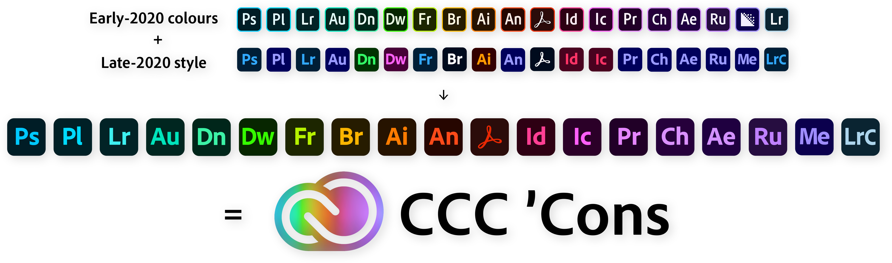

    <h1>
        
    </h1>
    <h3>
        
    </h3>
    <h4>
        <a href="#instructions">Instructions</a>
        •
        <a href="#roadmap">Roadmap</a>
        •
        <a href="#limitations">Limitations</a>
        •
        <a href="#acknowledgements">Acknowledgements</a>
    </h4>

---

A set of icon files that can be used to replace the installed app icons for the late-2020 editions of the [Adobe](https://www.adobe.com/) [Creative Cloud](https://www.adobe.com/creativecloud) suite of productivity applications on Windows and macOS. The shape of the graphics are the late-2020 style, but the colours have been restored to their classic, individually-branded app colours, so that they return to their easily identifiable state.

The main benefits are twofold:

1. **Apps in the same Adobe-defined “category” are now clearly distinguishable from one another** at a glance, reducing the chance of accidentally opening the wrong one, which can waste precious productivity time waiting for it to load just so it can be closed again…
2. In-line with the new Adobe CC logo, the icons when viewed together are now back to forming a large spectrum of colour, which is just **much more visually appealing**; makes sense for a suite of so-called “creative” apps!

## Instructions

### Generate the ICO files

1. Download [svg_to_ico](https://www.github.com/Ortham/svg_to_ico), keep the binary somewhere appropriate and add it to your path.
2. Open a PowerShell prompt with the working directory set to the repository’s root.
3. Run `generate.ps1`, which will generate ICO icon files from the source SVGs.
4. Find the generated ICO files in the newly-created `/output` directory.

### Apply the icons

#### Windows

1. Open Explorer and navigate to `C:\ProgramData\Microsoft\Windows\Start Menu\Programs`, which is where the system-wide Start menu shortcuts live.
2. For each installed app’s shortcut:
   1. Right-click it and click _“Properties”_.
   2. Click _“Change Icon…”_ followed by _“Browse…”_.
   3. Navigate to the directory containing the generated icons.
   4. Select the correct icon for the app and click _“Open”_.
   5. Finally, click _“OK”_ to apply the icon replacement.
3. Pin the app shortcuts to your Start menu and taskbar as desired to see them with the updated icons, as demonstrated in the screenshots below:

    
    
<i>Windows 10 dark theme</i>

    
    
<i>Windows 10 light theme</i>

#### macOS

_Instructions coming soon!_

## Roadmap

**These are some potential future improvements, in rough priority order:**

* Integrate the generation script with GitHub actions to automatically bundle and publish releases.
* Write instructions for applying the icons to macOS.
* Create a GitHub Pages website to demonstrate and promote the icon pack.
* Write a cross-platform “one-step” tool that applies all these icons automatically, to save it having to be done by hand.
* Publish said tool to the Windows Store and Mac App Store.
* Expand the set of icons to include the thumbnail variants that files associated with each application uses.
* Update for 2021+ whenever the icon style next changes…

## Limitations

* For some reason, some of the Start tile backgrounds in Windows 10’s October 2020 Update dark theme are lighter than others, rather than a consistent colour like they are in the light theme, presumably due to the overall icon graphic passing a certain luminance threshold. I have no idea if it’s possible to override this unfortunately.
* I haven’t tested these icons on macOS yet. As a Windows user, I don’t have a Mac myself, so if you have one and would be willing to test the instructions for me (as well as provide some specific screenshots needed to demo the icon pack on this README), then please do get in-touch by messaging me via [my LinkedIn profile](https://www.linkedin.com/in/andidavies92)!
* It’s currently impossible to change the icon for Windows Store apps, such as Adobe XD, so they are excluded from this icon pack. That being said, XD’s existing colours are similar to how they were before apps got bunched into groups, so the impact of this is minimal.
* Obviously it’s not possible without some _serious_ reverse engineering to replace the in-app icon assets, so the icons shown within the app will always have to be the official CC icons.
* I don’t yet know whether individual apps being updated via the Creative Cloud app clobber the existing shortcuts or not, so time will tell with that one. One slightly-ugly but pragmatic workaround to this would be to schedule a task to run at system startup that re-runs the [one-step tool](#roadmap) which would automatically apply the changes to any newly-created shortcuts.

## Acknowledgements

CCC ’Cons icon pack created by [Andi Emma Davies](https://www.github.com/andidavies92).

[Early-2020 icon PNGs](https://www.gumroad.com/l/xbxCK) created by [Conor Honer](https://www.behance.net/conorhoner).

[Late-2020 icon SVGs](https://www.stevenqueiruga.com/adobe-icons) created by [Steven Queiruga](https://www.stevenqueiruga.com/).

[svg_to_ico](https://www.github.com/Ortham/svg_to_ico) by [Oliver Hamlet](https://www.github.com/Ortham) is used to create the output ICO files (yay, [Rust](https://www.rust-lang.org/)!).

All brandnames and graphics Copyright © [Adobe Inc](https://www.adobe.com/) 2020. All rights reserved.
